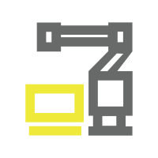

<!--
 * @Author: Hongkun Luo
 * @Date: 2024-07-24 03:11:30
 * @LastEditors: Hongkun Luo
 * @Description: 
 * 
 * Hongkun Luo
-->

# SuperVINS: A visual-inertial SLAM framework integrated deep learning features

       

<div align=center></div>

#  News
- 2024.10.6:add base code
- 2024.8.7:add demo video,add training DBoW3.
- 2024.7.31:Publish a preprint(Journal in submission).[Preprint](https://arxiv.org/abs/2407.21348): https://arxiv.org/abs/2407.21348


# Demo
### GIF
<div align=center></div>

### Video
If you want to watch the full demo video, please click the [link](resources/video.mp4)

# 1 Brief Introduction

This project is improved based on VINS-Fusion. [VINS-Fusion](https://github.com/HKUST-Aerial-Robotics/VINS-Fusion) is a well-known SLAM framework. The original version of VINS-Fusion front-end uses traditional geometric feature points and then performs optical flow tracking. This project uses the feature point method, introduces SuperPoint feature points and feature descriptors, and uses the LightGlue network for feature matching. In the loopback part, the original VINS-Fusion extracts the brief descriptor and uses DBoW2 for loopback detection. This project uses DBoW3 and SuperPoint deep learning descriptors for loopback detection. Created a SLAM system based on deep learning.

#  2 Build Project

### 2.1 **Ubuntu** and **ROS**

Ubuntu 64-bit 20.04.
ROS Noetic. **[ROS Installation](http://wiki.ros.org/ROS/Installation)**

### 2.2 **OpenCV**

OpenCV4.2.0. **[OpenCV4.2.0](https://github.com/opencv/opencv/archive/refs/tags/4.2.0.zip)**

if you use Ubuntu 20.04, you can install it by:`sudo apt-get install libopencv-dev`

### 2.3 **Ceres Solver**

Follow **[Ceres Installation](http://ceres-solver.org/installation.html)**.
**[Ceres 2.1.0](https://github.com/ceres-solver/ceres-solver/releases/tag/2.1.0)**.

### 2.4 **ONNX RUNTIME**

**[onnxruntime-linux-x64-gpu-1.16.3](https://github.com/microsoft/onnxruntime/releases/download/v1.16.3/onnxruntime-linux-x64-gpu-1.16.3.tgz)**

### 2.5 **install libraries to the specified path**

**If you want to install the third-party library in the specified path, you can follow the steps below**

```bash
mkdir build
cd build
cmake -D CMAKE_INSTALL_PREFIX="/some/where/local"  ..
make -j4
make install
```

# 3 Create a ROS1 workspace

```bash
mkdir -p ~/catkin_ws/src
cd ~/catkin_ws/src/
catkin_init_workspace
cd ~/catkin_ws
catkin_make
echo "source ~/catkin_ws/devel/setup.bash" >> ~/.bash
source ~/.bashrc
```

# 4 How does it work?

### 4.1 Clone project

```bash
  cd ~/catkin_ws/src
  git clone https://github.com/luohongk/SuperVINS.git
```

### 4.2 Data download

You can download the specified data set yourself, or you can use download_data.sh to download the data set. The download method is as follows.

```bash
cd ~/catkin_ws/src/SuperVINS
chmod +x download_data.sh
./download_data.sh
```

### 4.3 Path change

Absolute paths are used in some places in the project. You need to simply change the path configuration according to your own computer path. The change method is as follows

* file:vins_estimator\CMakeLists.txt , supervins_loop_fusion\CMakeLists.txt , camera_models\CMakeLists.txt

```bash
change
set(ONNXRUNTIME_ROOTDIR "/home/lhk/Thirdparty/onnxruntime")
find_package(Ceres REQUIRED PATHS "/home/lhk/Thirdparty/Ceres")
to
set(ONNXRUNTIME_ROOTDIR "your onnxruntime path")
find_package(Ceres REQUIRED PATHS "you Ceres path")
```

* file:supervins_loop_fusion\src\pose_graph_node.cpp
  line 554

```bash
change
string vocabulary_file = "/home/lhk/catkin_ws/src/VINS_SPLG_BOW/loop_fusion/src/ThirdParty/Voc/superpoint.yml.gz";
to
string vocabulary_file = "your superpoint.yml.gz path";
```

* file:config\euroc\euroc_mono_imu_config.yaml
  line:61,65,66

```bash
change
pose_graph_save_path: "/home/lhk/catkin_ws/src/SuperVINS/output"
extractor_weight_path: "/home/lhk/catkin_ws/src/SuperVINS/vins_estimator/weights_dpl/superpoint.onnx"
matcher_weight_path: "/home/lhk/catkin_ws/src/SuperVINS/vins_estimator/weights_dpl/superpoint_lightglue_fused_cpu.onnx" 
to
pose_graph_save_path: "you output path"
extractor_weight_path: "your superpoint.onnx path"
matcher_weight_path: "your superpoint_lightglue_fused_cpu.onnx path" 
```

### 4.4 Compile project

```bash
cd ~/catkin_ws
catkin_make
```

### 4.5 Run the project

```bash
roslaunch supervins supervins_rviz.launch
rosrun supervins supervins_node ~/catkin_ws/src/SuperVINS/config/euroc/euroc_mono_imu_config.yaml
rosrun supervins_loop_fusion supervins_loop_fusion_node ~/catkin_ws/src/SuperVINS/config/euroc/euroc_mono_imu_config.yaml
rosbag play ~/data/EuRoC/MH_01_easy.bag
```

If Python is installed on your computer, you can directly use the python script to run it with one click

```bash
cd ~/catkin_ws/src/SuperVINS
python run.py
```

# 5 Training DBoW3’s SuperPoint bag of words
[link](https://github.com/luohongk/SuperVINS/)
