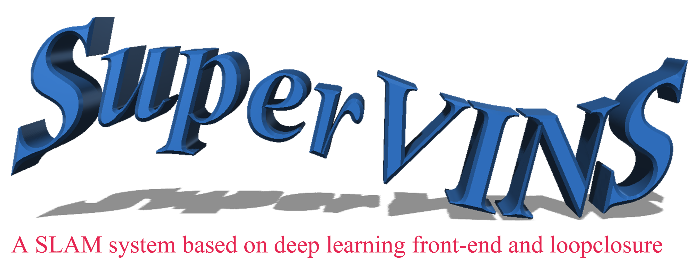

<!--
 * @Author: Hongkun Luo
 * @Date: 2024-07-24 03:11:30
 * @LastEditors: luohongk luohongkun@whu.edu.cn
 * @Description: 
 * 
 * Hongkun Luo
-->

<h2 align="center">SuperVINS: A Real-Time Visual-Inertial SLAM Framework<br>for Challenging Imaging Conditions</h2>
  <h3 align="center">
    <a href="https://luohongkun.top/scholar/">Hongkun Luo</a>, <a href="https://yangliu9527.github.io/">Yang Liu</a>, <a href="https://jszy.whu.edu.cn/guochi">Chi Guo</a>, <a href="https://cesi.cumt.edu.cn/info/1101/8625.htm">Zengke Li</a>, <a href="https://gnsscenter.whu.edu.cn/info/1301/1081.htm">Weiwei Song</a>
  </h3>
  <p align="center">
    <a href="https://luohongkun.top/SuperVINS/">Project Website</a> |
    <a href="https://ieeexplore.ieee.org/document/10949688">Paper (IEEE Sensors Journal)</a> |
    <a href="https://arxiv.org/abs/2407.21348">arXiv</a>
  </p>
  <p align="center">
      <a href="https://github.com/luohongk/SuperVINS">
          
      </a>
      <a href="https://cmake.org/">
          
      </a>
      <a href="https://github.com/cvg/LightGlue">
          
      </a>
      <a href="http://wiki.ros.org/noetic">
          
      </a>
      <a href="https://github.com/rmsalinas/DBow3">
          
      </a>
      <a href="https://www.gnu.org/licenses/gpl-3.0.html">
          
      </a>
      <a href="https://www.zhiyuteam.com/">
          
      </a>
  </p>

<div align=center></div>

---

## 📢 News

- **2026.05**: Released **SuperVINS 2.0** — Fixed memory leak bugs, added LightGlue-based loop closure verification (SuperPoint+LightGlue PnP), dense loop-corrected trajectory output (TUM format), and enhanced RViz visualization.
- **2025.03**: Published in **IEEE Sensors Journal**.
- **2025.03.07**: Released SuperVINS 1.0 with SuperPoint+LightGlue front-end.
- **2024.10.06**: Released base code.
- **2024.08.07**: Added demo.
- **2024.07.31**: Published preprint. [arXiv](https://arxiv.org/abs/2407.21348)

---

## 🎬 Demo

<div align=center></div>

Full demo video: [resources/video.mp4](resources/video.mp4)

---

## 🔍 Overview

SuperVINS is a real-time Visual-Inertial SLAM system built upon [VINS-Fusion](https://github.com/HKUST-Aerial-Robotics/VINS-Fusion), replacing traditional handcrafted features with deep-learning-based feature extraction and matching throughout the entire pipeline:

| Module                       | VINS-Fusion (Original)    | SuperVINS                                              |
| ---------------------------- | ------------------------- | ------------------------------------------------------ |
| **Feature Extraction** | Shi-Tomasi corners        | SuperPoint (learned keypoints + descriptors)           |
| **Feature Matching**   | Optical flow (KLT)        | LightGlue (learned matcher via ONNX Runtime GPU)       |
| **Loop Detection**     | DBoW2 + BRIEF             | DBoW3 + SuperPoint descriptors                         |
| **Loop Verification**  | BRIEF descriptor matching | **SuperPoint + LightGlue matching + PnP RANSAC** |

### Why "SuperVINS"?

The name honors **SuperPoint** and **VINS-Fusion** — "Super" refers to the SuperPoint descriptor that runs through both front-end tracking and loop closure, while "VINS" acknowledges the visual-inertial fusion backbone.

---

## 📦 Download Datasets

```bash
cd ~/catkin_ws/src/SuperVINS
chmod +x download_data.sh
./download_data.sh
```

Or manually download [EuRoC MAV Dataset](https://projects.asl.ethz.ch/datasets/doku.php?id=kmavvisualinertialdatasets) and place the rosbag files in your data directory.

---

## 🐳 Quick Start (Docker, Recommended)

### 📋 Prerequisites

- NVIDIA GPU (tested on RTX 4060, RTX 3090)
- [NVIDIA Container Toolkit](https://docs.nvidia.com/datacenter/cloud-native/container-toolkit/latest/install-guide.html)
- Docker

### 🏗️ 1. Build or Pull Docker Image

```bash
# Option A (Recommended): Pull pre-built image (~7.18 GB, CUDA 11.8, Ubuntu 20.04，Noetic)
docker pull luohongkun0715/supervins:latest

# Option B: Build from Dockerfile (very slow)
cd SuperVINS
docker build -f docker/Dockerfile -t supervins:latest .
```

### 🚀 2. Run Container

```bash
xhost +local:root && \
docker run -it \
  --gpus all \
  --network=host \
  --privileged \
  -v /tmp/.X11-unix:/tmp/.X11-unix \
  -e DISPLAY=$DISPLAY \
  -v <YOUR_SUPERVINS_PATH>:/root/catkin_ws/src/SuperVINS \
  -v <YOUR_DATA_PATH>:/data \
  --name supervins_work \
  -w /root/catkin_ws \
  supervins:latest
```

> Replace `<YOUR_SUPERVINS_PATH>` with your local SuperVINS repo path, and `<YOUR_DATA_PATH>` with your dataset directory.

For example:

```bash
xhost +local:root && \
docker run -it \
  --gpus all \
  --network=host \
  --privileged \
  -v /tmp/.X11-unix:/tmp/.X11-unix \
  -e DISPLAY=$DISPLAY \
  -v /home/lhk/workspace/SuperVINS:/root/catkin_ws/src/SuperVINS \
  -v /home/lhk/data:/data \
  --name supervins_work \
  -w /root/catkin_ws \
  supervins:latest
```

### 🔨 3. Build Inside Container

```bash
cd ~/catkin_ws
source /opt/ros/noetic/setup.bash
source devel/setup.bash
catkin_make -DCMAKE_BUILD_TYPE=Release -j8
```

### ▶️ 4. Run

Open **4 terminals** (or use tmux) inside the container:

```bash
# Terminal 1: RViz visualization
cd ~/catkin_ws
source devel/setup.bash
roslaunch supervins supervins_rviz.launch

# Terminal 2: VIO front-end
cd ~/catkin_ws
source devel/setup.bash
rosrun supervins supervins_node ~/catkin_ws/src/SuperVINS/config/euroc/euroc_mono_imu_config.yaml

# Terminal 3: Loop fusion
cd ~/catkin_ws
source devel/setup.bash
rosrun supervins_loop_fusion supervins_loop_fusion_node ~/catkin_ws/src/SuperVINS/config/euroc/euroc_mono_imu_config.yaml

# Terminal 4: Play dataset
cd ~/catkin_ws
source devel/setup.bash
rosbag play /data/V2_01_easy.bag
```

### 🗺️ Trajectory Visualization

| Color  | Topic                                          | Description                                         |
| ------ | ---------------------------------------------- | --------------------------------------------------- |
| Green  | `/supervins_estimator/path`                  | Real-time VIO trajectory (no loop closure)          |
| Orange | `/supervins_loop_fusion/loop_corrected_path` | Dense loop-corrected trajectory (smooth, per-frame) |
| Red    | `/supervins_loop_fusion/pose_graph_path`     | Pose graph optimized keyframe trajectory            |

The loop-corrected trajectory is automatically saved in **TUM format** to `<output_path>/loop_corrected_tum.txt` for offline evaluation with [EVO](https://github.com/MichaelGrupp/evo):

```bash
evo_ape tum groundtruth.txt loop_corrected_tum.txt -va --plot
```

---

## 🔧 Build Without Docker

### 📋 Dependencies

| Dependency   | Version        | Notes                                                                                                            |
| ------------ | -------------- | ---------------------------------------------------------------------------------------------------------------- |
| Ubuntu       | 20.04 (64-bit) |                                                                                                                  |
| ROS          | Noetic         | [Installation](http://wiki.ros.org/ROS/Installation)                                                                |
| OpenCV       | >= 4.2.0       | `sudo apt-get install libopencv-dev`                                                                           |
| Ceres Solver | >= 2.1.0       | [Installation](http://ceres-solver.org/installation.html)                                                           |
| ONNX Runtime | 1.16.3 (GPU)   | [Download](https://github.com/microsoft/onnxruntime/releases/download/v1.16.3/onnxruntime-linux-x64-gpu-1.16.3.tgz) |
| CUDA         | >= 11.0        | Required for ONNX Runtime GPU                                                                                    |

### 🏗️ Build Steps

```bash
# 1. Create workspace
mkdir -p ~/catkin_ws/src && cd ~/catkin_ws/src
catkin_init_workspace

# 2. Clone
git clone https://github.com/luohongk/SuperVINS.git

# 3. Build
cd ~/catkin_ws
catkin_make -DCMAKE_BUILD_TYPE=Release
```

### ▶️ Run

```bash
# Terminal 1: RViz visualization
cd ~/catkin_ws
source devel/setup.bash
roslaunch supervins supervins_rviz.launch

# Terminal 2: VIO front-end
cd ~/catkin_ws
source devel/setup.bash
rosrun supervins supervins_node ~/catkin_ws/src/SuperVINS/config/euroc/euroc_mono_imu_config.yaml

# Terminal 3: Loop fusion
cd ~/catkin_ws
source devel/setup.bash
rosrun supervins_loop_fusion supervins_loop_fusion_node ~/catkin_ws/src/SuperVINS/config/euroc/euroc_mono_imu_config.yaml

# Terminal 4: Play dataset
cd ~/catkin_ws
source devel/setup.bash
rosbag play /data/V2_01_easy.bag
```

### ⚙️ Configuration

Key parameters in config YAML files (e.g., `config/euroc/euroc_mono_imu_config.yaml`):

| Parameter                  | Description                              | Default                                         |
| -------------------------- | ---------------------------------------- | ----------------------------------------------- |
| `extractor_weight_path`  | SuperPoint ONNX model path               | `weights_dpl/superpoint.onnx`                 |
| `matcher_weight_path`    | LightGlue ONNX model path                | `weights_dpl/superpoint_lightglue_fused.onnx` |
| `matche_score_threshold` | LightGlue match confidence threshold     | `0.5`                                         |
| `voc_relative_path`      | DBoW3 vocabulary path for loop detection | `ThirdParty/Voc/superpoint1.yml.gz`           |

Path configuration in CMakeLists.txt (`supervins_estimator`, `supervins_loop_fusion`, `camera_models`):

```cmake
set(ONNXRUNTIME_ROOTDIR "<your_onnxruntime_path>")
find_package(Ceres REQUIRED PATHS "<your_ceres_path>")
```

---

## 📚 Train Vocabulary

To train a custom DBoW3 vocabulary with SuperPoint descriptors, refer to the [DBoW3 official repository](https://github.com/rmsalinas/DBow3).

---

## 📖 Citation

If you find SuperVINS useful in your research, please cite:

```bibtex
@article{luo2025supervins,
  title     = {SuperVINS: A Real-Time Visual-Inertial SLAM Framework for Challenging Imaging Conditions},
  author    = {Luo, Hongkun and Liu, Yang and Guo, Chi and Li, Zengke and Song, Weiwei},
  journal   = {IEEE Sensors Journal},
  year      = {2025},
  publisher = {IEEE},
  doi       = {10.1109/JSEN.2025.3553653}
}
```

---

## 🙏 Acknowledgements

SuperVINS is built upon the following outstanding open-source projects:

- [VINS-Fusion](https://github.com/HKUST-Aerial-Robotics/VINS-Fusion) — Visual-Inertial SLAM backbone
- [SuperPoint](https://github.com/magicleap/SuperPointPretrainedNetwork) — Learned feature detector and descriptor
- [LightGlue](https://github.com/cvg/LightGlue) — Learned feature matcher
- [LightGlue-OnnxRunner](https://github.com/OroChippw/LightGlue-OnnxRunner) — ONNX deployment reference
- [DBoW3](https://github.com/rmsalinas/DBow3) — Bag-of-Words loop detection

We also gratefully acknowledge the following community projects for actively testing, extending, and demonstrating SuperVINS. Feel free to reach out to their authors for related questions:

- **[DR-VINS](https://github.com/jzk0406/DR-VINS)** — A community extension of SuperVINS tested for degraded visual scenes (low texture, illumination change, overexposure, indoor-outdoor transition)
  - Additional demos and visualizations: [release demos](https://github.com/jzk0406/DR-VINS/releases/tag/v1.0-demo) · [trajectory figures](https://github.com/jzk0406/DR-VINS/tree/main/results/trajectory_figures)
- **[SuperVINS ROS2](https://github.com/vanstrong12138/SuperVINS)**— ROS 2 implementation of SuperVINS
- **[AdaptiveVINS](https://github.com/alexanderbowler/AdaptiveVINS.git)** — An adaptive visual-inertial odometry extension built upon SuperVINS and VINS-Fusion, which adaptively fuses classical optical flow front-end and deep learning-based front-end to balance localization accuracy and computational overhead
- **[SuperVINS (Webots Adapted)](https://github.com/liuming706/SuperVINS)**— A customized fork fully adapted for Webots robot simulation, with revised camera models, simulation configs and dedicated compilation scripts

Finally, we thank the [*Wuhan University BRAIN Lab*](https://www.zhiyuteam.com/) for supporting this project.

---

## 📄 License

SuperVINS is released under the [GNU General Public License v3.0](https://www.gnu.org/licenses/gpl-3.0.html).
